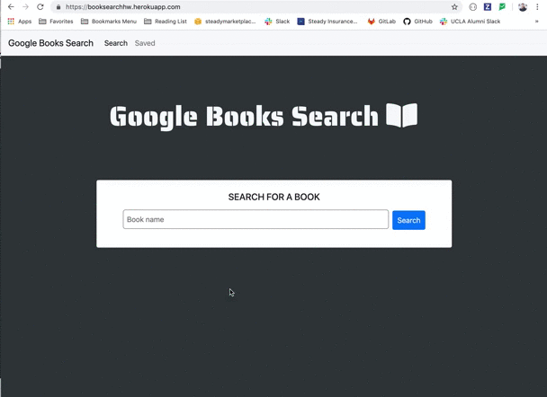
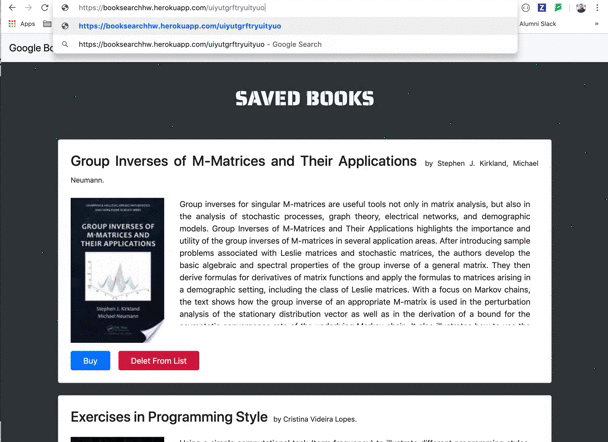

# NYT GOOGLE BOOK SEARCH

"NYT GOOGLE BOOK SEARCH" is an search app build using MERN stack MongoDB, Express, React and Node.js. It allows the user to search the google books API and save books to the saved books list. If the user wants to purchase the book he can simply press "Buy" and the application will direct him to that book's page on the google book store. Also, if the user changes his mind, he can delete the book from his saved books list. To see the application in action [Click here](https://booksearchhw.herokuapp.com/).

## See the app in action!

1. SEARCH, SAVE and DELETE

2. BOOK NOT FOUND.

3. INCORECT URL.

4. BUY BOOK.

## Built With

* Express
* React
* Mongoose
* Axios
* Node.js
